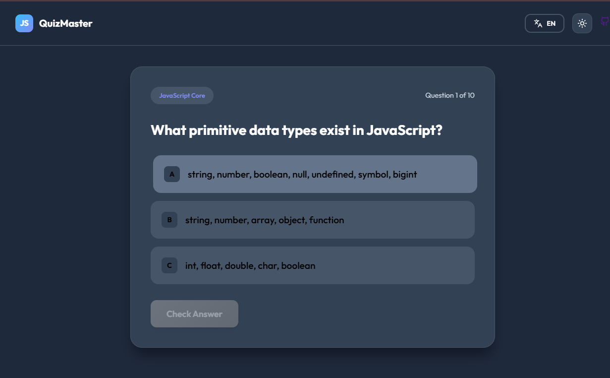

# JS QuizMaster - Frontend Developer Quiz

Interactive quiz application for JS Middle developers. Built with Vue 3, TypeScript, and modern aesthetics.



## Features

- 🧠 **JS Native Knowledge**: Questions tailored for Middle-level developers.
- 🌍 **Multi-language**: Full support for English and Russian.
- 🌓 **Dynamic Theming**: Premium dark and light modes.
- ⚡ **Modern Stack**: Vue 3 (Composition API), Vite, TypeScript, and SCSS.
- 📱 **Responsive Design**: Glassmorphism UI that looks great on any device.

## Getting Started

Follow these steps to run the project locally.

### Prerequisites

- Node.js (v18 or higher)
- npm or yarn

### Installation

```bash
# Clone the repository
git clone https://github.com/digitalfuture/frontend-quiz-master.git

# Navigate to project folder
cd frontend-quiz-master

# Install dependencies
npm install
```

### Development

```bash
# Run development server
npm run dev
```

### Build

```bash
# Build for production
npm run build

# Preview production build
npm run preview
```

## Tech Stack

- **Framework**: [Vue 3](https://vuejs.org/)
- **Build Tool**: [Vite](https://vitejs.dev/)
- **Language**: [TypeScript](https://www.typescriptlang.org/)
- **Styles**: [SCSS](https://sass-lang.com/)
- **Icons**: [Lucide Vue Next](https://lucide.dev/)
- **i18n**: [Vue I18n](https://vue-i18n.intlify.dev/)
